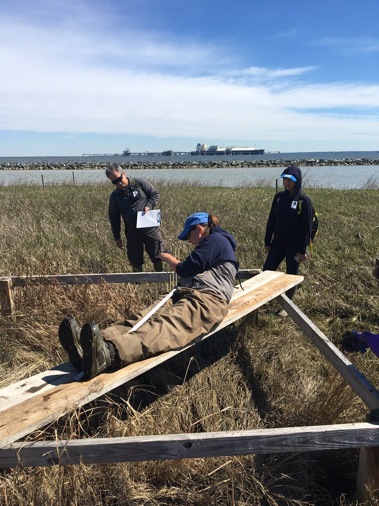

```{r setup, include=FALSE}
knitr::opts_chunk$set(echo = TRUE)
```

##Activity Summary
####April
* Salinity Surveys
* Maintain Hobo sensors and download Hobo data
* Work on annual report
* Present results of monitoring at Atlantic Estuarine Research Society meeting
* rSET and Marker Horizon Readings
* Demonstrations of Marsh Monitoring Techniques

####May (expected)
* Salinity Surveys
* Maintain Hobo sensors and download Hobo data
* Spring Percent Cover Surveys
* High School Planting event
* Submit annual report draft for comment

##Items of Note/Concern:
* Hobos at the North, South and Mid Station were pulled April 16th after YSI had redeployed the Sondes.




##Plots
Below are the plots for the Hobos for the month of April.

###Water Level

```{r echo=FALSE, warning=FALSE, message=FALSE, results='hide', fig.keep='all'}
library(dplyr)
library(ggplot2)
library(lubridate)

theme_hoboplot<-function(){
  theme(plot.subtitle = element_text(vjust = 1), 
        plot.caption = element_text(vjust = 1), 
        axis.line = element_line(size = 0.7), 
        axis.ticks = element_line(size = 0.75), 
        panel.grid.major = element_line(colour = "gray86", 
                                        linetype = "dashed"), panel.grid.minor = element_line(colour = NA), 
        axis.title = element_text(size = 14), 
        axis.text = element_text(size = 12, colour = "black"), 
        axis.text.x = element_text(size = 12), 
        axis.text.y = element_text(size = 12), 
        plot.title = element_text(size = 16), 
        legend.text = element_text(size = 11), 
        legend.title = element_text(size = 12), 
        panel.background = element_rect(fill = NA), 
        plot.background = element_rect(colour = NA), 
        legend.key = element_rect(fill = NA), 
        legend.background = element_rect(fill = NA))
}

water_level<-readRDS("water_level2019.rds")
water_level$date<-date(water_level$datetime)
water_level$hour<-hour(water_level$datetime)
water_level$month<-month(water_level$datetime)
water_level$station<-as.factor(water_level$station)

hpal7<-c("north"="#FF5765", "mid" = "#FFDB15", "south"="#8A6FDF", "weir"="#A8E10C")

a<-water_level %>% 
  filter(month==4) %>% 
  select(date, hour, temp, depth, station) %>% 
  group_by(date, hour, station) %>% 
  summarise_if(is.numeric, mean) %>% 
  mutate(datetime=ymd_hm(paste0(date, " ", hour, ":00"))) %>% 
  ggplot(., aes(x=datetime))+
  geom_line(aes(y=depth, color = station), size=1.2)+
  theme_hoboplot()+
  scale_color_manual(values = hpal7, breaks=c("north", "mid", "south", "weir"), name="Station")+
  ggtitle("April Water Level - Hourly means")+
  xlab("Date")+ylab("Depth (m)")+ 
  guides(colour = guide_legend(override.aes = list(size=2.5)))
a
```


###Salinity

```{r echo=FALSE, warning=FALSE, message=FALSE, results='hide', fig.keep='all'}
library(dplyr)
library(ggplot2)
library(lubridate)

theme_hoboplot<-function(){
  theme(plot.subtitle = element_text(vjust = 1), 
        plot.caption = element_text(vjust = 1), 
        axis.line = element_line(size = 0.7), 
        axis.ticks = element_line(size = 0.75), 
        panel.grid.major = element_line(colour = "gray86", 
                                        linetype = "dashed"), panel.grid.minor = element_line(colour = NA), 
        axis.title = element_text(size = 14), 
        axis.text = element_text(size = 12, colour = "black"), 
        axis.text.x = element_text(size = 12), 
        axis.text.y = element_text(size = 12), 
        plot.title = element_text(size = 16), 
        legend.text = element_text(size = 11), 
        legend.title = element_text(size = 12), 
        panel.background = element_rect(fill = NA), 
        plot.background = element_rect(colour = NA), 
        legend.key = element_rect(fill = NA), 
        legend.background = element_rect(fill = NA))
}

hpal7<-c("north"="#FF5765", "mid" = "#FFDB15", "south"="#8A6FDF", "weir"="#A8E10C")

salinity<-readRDS("hobo_salinity_2019.rds")

salinity$date<-date(salinity$datetime)
salinity$hour<-hour(salinity$datetime)
salinity$month<-month(salinity$datetime)
salinity$station<-as.factor(salinity$station)

b<-salinity %>% 
  filter(month==4) %>% 
  select(date, hour, temperature, salinity, station) %>% 
  group_by(date, hour, station) %>% 
  summarise_if(is.numeric, mean) %>% 
  mutate(datetime=ymd_hm(paste0(date, " ", hour, ":00"))) %>% 
  ggplot(., aes(x=datetime))+
  geom_line(aes(y=salinity, color = station), size=1.2)+
  theme_hoboplot()+
  scale_color_manual(values = hpal7, breaks=c("north", "mid", "south", "weir"), name="Station")+
  ggtitle("April Salinity - Hourly means")+
  xlab("Date")+ylab("Salinity (ppt)")+ 
  guides(colour = guide_legend(override.aes = list(size=2.5)))
b

```

![Note that there is no South Station because of the lost Hobo.]


###Dominion Distribution List
1. Paul Dickson, Dominion (paul.e.dickson@dom.com)
2. Mike Gardner, Dominion (Michael.e.gardner@dom.com)
3. Jasmine L Morris (Jasmine.L.Morris@dom.com)
4. Dominion Biology Group Contact, Matt Overton (matt.overton@dom.com)
