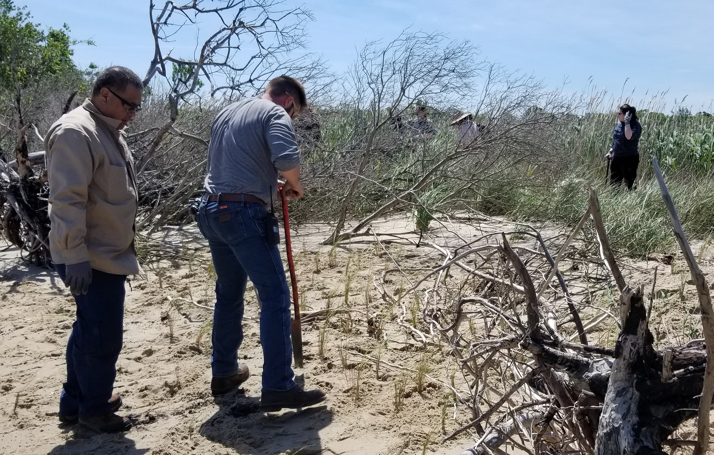

```{r setup, include=FALSE}
knitr::opts_chunk$set(echo = TRUE)
```

##Activity Summary
####May
* Salinity Surveys
* Download Weir Hobo Data
* Spring Percent Cover Survey
* Planting With Huntington High School

####June (expected)
* Salinity Surveys
* Maintain Hobo sensors and download Hobo data 
* RTE Survey with Brent Steury

##Items of Note/Concern:
* Because of the salinity fluctuations we saw in April we started measuring the salinity in the weir boxes during Kayak Surveys.  There was no difference in the salinity within the weir boxes and the pond during our two visits in May.
* During the Percent Cover Survey we saw Lespedeza cuneata near Transect 3.  We also found  Japanese Rose along the dune near the Poplar Street entrance. Both are invasive species.
* For the Planting event with Huntington High School we planted in the area buried by the overwash in 2017.  This area was formerly colonized by the RTE Carex hyalinolepis and we were hoping it would grown back, however conditions have changed so it no longer seems likely that it will return.  



##Plots
Below are the plots for the Hobos for the month of May.

###Water Level

```{r echo=FALSE, warning=FALSE, message=FALSE, results='hide', fig.keep='all'}
library(dplyr)
library(ggplot2)
library(lubridate)

theme_hoboplot<-function(){
  theme(plot.subtitle = element_text(vjust = 1), 
        plot.caption = element_text(vjust = 1), 
        axis.line = element_line(size = 0.7), 
        axis.ticks = element_line(size = 0.75), 
        panel.grid.major = element_line(colour = "gray86", 
                                        linetype = "dashed"), panel.grid.minor = element_line(colour = NA), 
        axis.title = element_text(size = 14), 
        axis.text = element_text(size = 12, colour = "black"), 
        axis.text.x = element_text(size = 12), 
        axis.text.y = element_text(size = 12), 
        plot.title = element_text(size = 16), 
        legend.text = element_text(size = 11), 
        legend.title = element_text(size = 12), 
        panel.background = element_rect(fill = NA), 
        plot.background = element_rect(colour = NA), 
        legend.key = element_rect(fill = NA), 
        legend.background = element_rect(fill = NA))
}

water_level<-readRDS("water_level2019.rds")
water_level$date<-date(water_level$datetime)
water_level$hour<-hour(water_level$datetime)
water_level$month<-month(water_level$datetime)
water_level$station<-as.factor(water_level$station)

hpal7<-c("north"="#FF5765", "mid" = "#FFDB15", "south"="#8A6FDF", "weir"="#A8E10C")

a<-water_level %>% 
  filter(month==5) %>% 
  select(date, hour, temp, depth, station) %>% 
  group_by(date, hour, station) %>% 
  summarise_if(is.numeric, mean) %>% 
  mutate(datetime=ymd_hm(paste0(date, " ", hour, ":00"))) %>% 
  ggplot(., aes(x=datetime))+
  geom_line(aes(y=depth, color = station), size=1.2)+
  theme_hoboplot()+
  scale_color_manual(values = hpal7, breaks=c("north", "mid", "south", "weir"), name="Station")+
  ggtitle("May Water Level - Hourly means")+
  xlab("Date")+ylab("Depth (m)")+ 
  guides(colour = guide_legend(override.aes = list(size=2.5)))
a
```


###Salinity

```{r echo=FALSE, warning=FALSE, message=FALSE, results='hide', fig.keep='all'}
library(dplyr)
library(ggplot2)
library(lubridate)

theme_hoboplot<-function(){
  theme(plot.subtitle = element_text(vjust = 1), 
        plot.caption = element_text(vjust = 1), 
        axis.line = element_line(size = 0.7), 
        axis.ticks = element_line(size = 0.75), 
        panel.grid.major = element_line(colour = "gray86", 
                                        linetype = "dashed"), panel.grid.minor = element_line(colour = NA), 
        axis.title = element_text(size = 14), 
        axis.text = element_text(size = 12, colour = "black"), 
        axis.text.x = element_text(size = 12), 
        axis.text.y = element_text(size = 12), 
        plot.title = element_text(size = 16), 
        legend.text = element_text(size = 11), 
        legend.title = element_text(size = 12), 
        panel.background = element_rect(fill = NA), 
        plot.background = element_rect(colour = NA), 
        legend.key = element_rect(fill = NA), 
        legend.background = element_rect(fill = NA))
}

hpal7<-c("north"="#FF5765", "mid" = "#FFDB15", "south"="#8A6FDF", "weir"="#A8E10C")

salinity<-readRDS("hobo_salinity_2019.rds")

salinity$date<-date(salinity$datetime)
salinity$hour<-hour(salinity$datetime)
salinity$month<-month(salinity$datetime)
salinity$station<-as.factor(salinity$station)

b<-salinity %>% 
  filter(month==5) %>% 
  select(date, hour, temperature, salinity, station) %>% 
  group_by(date, hour, station) %>% 
  summarise_if(is.numeric, mean) %>% 
  mutate(datetime=ymd_hm(paste0(date, " ", hour, ":00"))) %>% 
  ggplot(., aes(x=datetime))+
  geom_line(aes(y=salinity, color = station), size=1.2)+
  theme_hoboplot()+
  scale_color_manual(values = hpal7, breaks=c("north", "mid", "south", "weir"), name="Station")+
  ggtitle("May Salinity - Hourly means")+
  xlab("Date")+ylab("Salinity (ppt)")+ 
  guides(colour = guide_legend(override.aes = list(size=2.5)))
b

```
![Note that we are seeing some salinity increases but they are small and not increasing futher away from the weir boxes themselves.]


###Dominion Distribution List
1. Paul Dickson, Dominion (paul.e.dickson@dom.com)
2. Mike Gardner, Dominion (Michael.e.gardner@dom.com)
3. Jasmine L Morris (Jasmine.L.Morris@dom.com)
4. Dominion Biology Group Contact, Matt Overton (matt.overton@dom.com)
