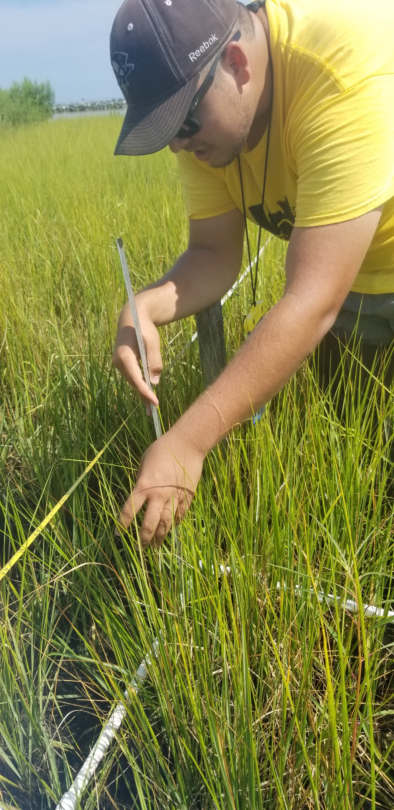

```{r setup, include=FALSE}
knitr::opts_chunk$set(echo = TRUE)
```

##Activity Summary
####August
* Salinity Surveys
* Download Weir Hobo Data
* Percent Cover Surveys
* PEET Plot Surveys
* Phragmites Biomass Collection
* Invasive Species Surveys
* HOBO recovery

####September (expected)
* Salinity Surveys
* RTE Survey with Brent Steury

##Items of Note/Concern:
*  We recovered 5 of the Sensors that were lost this winter and were able to also retrieve data off of them.  We are still evaluating the data to see if we think it is good enough to use. 
*  During the Vegetation Surveys we noticed a large patch of Lespedeza by Transect 3



##Plots
Below are the plots for the Hobos for the month of August.

###Water Level

```{r echo=FALSE, warning=FALSE, message=FALSE, results='hide', fig.keep='all'}
library(dplyr)
library(ggplot2)
library(lubridate)

theme_hoboplot<-function(){
  theme(plot.subtitle = element_text(vjust = 1), 
        plot.caption = element_text(vjust = 1), 
        axis.line = element_line(size = 0.7), 
        axis.ticks = element_line(size = 0.75), 
        panel.grid.major = element_line(colour = "gray86", 
                                        linetype = "dashed"), panel.grid.minor = element_line(colour = NA), 
        axis.title = element_text(size = 14), 
        axis.text = element_text(size = 12, colour = "black"), 
        axis.text.x = element_text(size = 12), 
        axis.text.y = element_text(size = 12), 
        plot.title = element_text(size = 16), 
        legend.text = element_text(size = 11), 
        legend.title = element_text(size = 12), 
        panel.background = element_rect(fill = NA), 
        plot.background = element_rect(colour = NA), 
        legend.key = element_rect(fill = NA), 
        legend.background = element_rect(fill = NA))
}

water_level<-readRDS("water_level2019.rds")
water_level$date<-date(water_level$datetime)
water_level$hour<-hour(water_level$datetime)
water_level$month<-month(water_level$datetime)
water_level$station<-as.factor(water_level$station)

hpal7<-c("north"="#FF5765", "mid" = "#FFDB15", "south"="#8A6FDF", "weir"="#A8E10C")

a<-water_level %>% 
  filter(month==8) %>% 
  select(date, hour, temp, depth, station) %>% 
  group_by(date, hour, station) %>% 
  summarise_if(is.numeric, mean) %>% 
  mutate(datetime=ymd_hm(paste0(date, " ", hour, ":00"))) %>% 
  ggplot(., aes(x=datetime))+
  geom_line(aes(y=depth, color = station), size=1.2)+
  theme_hoboplot()+
  scale_color_manual(values = hpal7, breaks=c("north", "mid", "south", "weir"), name="Station")+
  ggtitle("August Water Level - Hourly means")+
  xlab("Date")+ylab("Depth (m)")+ 
  guides(colour = guide_legend(override.aes = list(size=2.5)))
a
```


###Salinity

```{r echo=FALSE, warning=FALSE, message=FALSE, results='hide', fig.keep='all'}
library(dplyr)
library(ggplot2)
library(lubridate)

theme_hoboplot<-function(){
  theme(plot.subtitle = element_text(vjust = 1), 
        plot.caption = element_text(vjust = 1), 
        axis.line = element_line(size = 0.7), 
        axis.ticks = element_line(size = 0.75), 
        panel.grid.major = element_line(colour = "gray86", 
                                        linetype = "dashed"), panel.grid.minor = element_line(colour = NA), 
        axis.title = element_text(size = 14), 
        axis.text = element_text(size = 12, colour = "black"), 
        axis.text.x = element_text(size = 12), 
        axis.text.y = element_text(size = 12), 
        plot.title = element_text(size = 16), 
        legend.text = element_text(size = 11), 
        legend.title = element_text(size = 12), 
        panel.background = element_rect(fill = NA), 
        plot.background = element_rect(colour = NA), 
        legend.key = element_rect(fill = NA), 
        legend.background = element_rect(fill = NA))
}

hpal7<-c("north"="#FF5765", "mid" = "#FFDB15", "south"="#8A6FDF", "weir"="#A8E10C")

salinity<-readRDS("hobo_salinity_2019.rds")

salinity$date<-date(salinity$datetime)
salinity$hour<-hour(salinity$datetime)
salinity$month<-month(salinity$datetime)
salinity$station<-as.factor(salinity$station)

b<-salinity %>% 
  filter(month==8) %>% 
  select(date, hour, temperature, salinity, station) %>% 
  group_by(date, hour, station) %>% 
  summarise_if(is.numeric, mean) %>% 
  mutate(datetime=ymd_hm(paste0(date, " ", hour, ":00"))) %>% 
  ggplot(., aes(x=datetime))+
  geom_line(aes(y=salinity, color = station), size=1.2)+
  theme_hoboplot()+
  scale_color_manual(values = hpal7, breaks=c("north", "mid", "south", "weir"), name="Station")+
  ggtitle("August Salinity - Hourly means")+
  xlab("Date")+ylab("Salinity (ppt)")+ 
  guides(colour = guide_legend(override.aes = list(size=2.5)))
b

```


###Dominion Distribution List
1. Paul Dickson, Dominion (paul.e.dickson@dom.com)
2. Mike Gardner, Dominion (Michael.e.gardner@dom.com)
3. Jasmine L Morris (Jasmine.L.Morris@dom.com)
4. Dominion Biology Group Contact, Matt Overton (matt.overton@dom.com)
